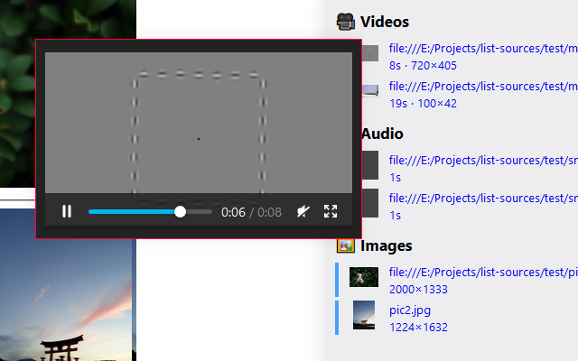

# List Sources

A small WebExtension to list all sources for videos, images, and audio elements on a page as digging around the inspector is a pain.

Attempts to extract background images, scans for dynamically added media, and includes previews for sources.

Works standalone, but was made to be compatiable with [Save In](https://github.com/gyng/save-in/).
